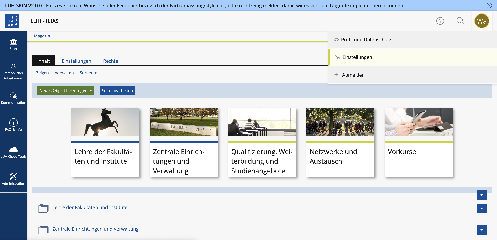

# LUH-Skin

Dieser Skin wurde dem [LUH-Stil](https://www.uni-hannover.de/) entsprechend angepasst.

---

## Version
v2.0.0

* [CHANGELOG](CHANGELOG.md)

---

## 📸 Screenshot


---

## 📁 Installation

### Schritt 1: Zur ILIAS-Root-Installation wechseln

```bash
cd /srv/ilias-luh/ILIAS/
cd Customizing/global/
```

### Schritt 2: Ordner "skin" anlegen (falls nicht vorhanden)

```bash
mkdir skin
cd skin
```

### Schritt 3: LUH-Skin klonen

```bash
git clone https://github.com/iFadi/LUH-Skin.git
cd LUH-Skin
```

### Schritt 4: Branch oder Tag auswählen

Beispiel für einen stabilen Release-Tag:

```bash
git checkout tags/v2.0.0
```

Falls du dich auf dem `release_9`-Branch befindest, kannst du einfach ein Pull durchführen:

```bash
git pull
```

✅ Das war’s – der Skin ist installiert.

---

## 🔧 Für die Implementierung

Zur Anpassung des Skins müssen die `.dart-sess`-Dateien bearbeitet werden. Anschließend ist das Skript `update-skin.sh` **als root** auszuführen, um die **SCSS-Dateien zu kompilieren**:

```bash
sudo ./update-skin.sh
```

### 📌 Hinweise:

* Das Skript verwendet die **Systemzeit**, um die generierten CSS-Dateien mit einer **eindeutigen ID** zu versehen.
* Diese ID wird an den Hauptdateinamen `LUH-Style.css` angehängt. → Dadurch wird ein **automatisches Neuladen im Browser** erzwungen (Cache-Busting).
* Sollte auf dem produktiven System `dart-sass` **nicht installiert** sein, kann das Skript **nicht ausgeführt** werden.

### 💡 Empfehlung:

Kompiliere die `LUH-Style.css` auf einem **Testsystem** (z. B. mit definierter Tag-/Skin-Version) und übertrage sie anschließend auf das **Produktivsystem**.

---

## ✅ Kompatibilität

Dieses Release wurde erfolgreich getestet mit:

* **ILIAS v9.15**

---

## ⚠️ Wartungshinweis

Bei **jedem ILIAS-Update** (Minor- und Major-Versionen) muss:

* der **Skin neu kompiliert** werden
* die **Funktionalität des Skins getestet** werden, um sicherzustellen, dass er weiterhin korrekt dargestellt wird

---
