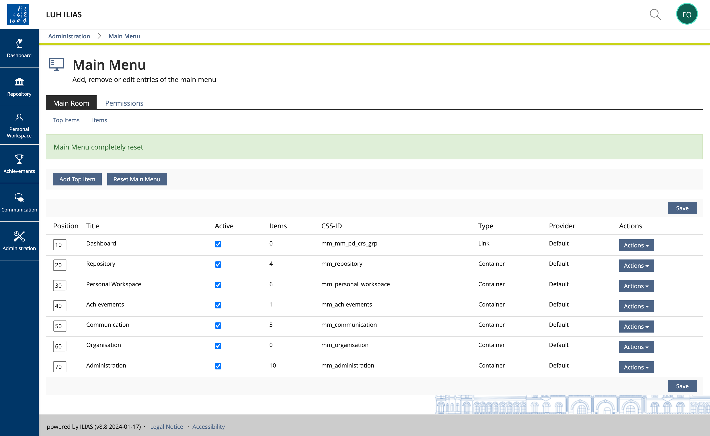

# LUH-Skin
Dieser Skin wurde dem [LUH-Stil](https://www.uni-hannover.de/) entsprechend angepasst.

## Version
v2.0.0

- [CHANGELOG](CHANGELOG.md)

## Screenshot


## Installation

Um das Skin zu installieren, sollte man zur {ILIAS Root}-Installation navigieren, zum Beispiel.
`/srv/ilias-luh/ILIAS`

```
cd /srv/ilias-luh/ILIAS/
cd Customizing/global/
```


Falls der Ordner 'skin' nicht vorhanden ist, dann anlegen.

```
mkdir skin
cd skin
```

Nun werden wir den LUH-Skin innerhalb des Skin-Ordners installieren; dazu führen wir einfach einen Git-Clone-Befehl aus:

`git clone https://github.com/iFadi/LUH-Skin.git`

Dann den entsprechenden Branch bzw. Tag auswählen z.B.:

`git checkout tags/v2.0.0`

bzw. falls man auf dem ilias-9x branch ist, dann kann man einfach git pull machen.

`git pull`


Das war es.

## Für die Implementierung

Less-Dateien anpassen. Danach das Skript `update-skin.sh` als root ausführen, um die Less-Dateien zu kompilieren.

```sudo ./update-skin.sh```

Dieses Skript benutzt die Systemzeit, um die CSS-Dateien mit einer eindeutigen ID zu versehen. 
Diese ID wird an den Hauptdateinamen des Skins LUH-Style.css angehängt, um das Neuladen der Skin-Änderungen im Browser zu erzwingen.
Falls auf dem produktiven System `dart-sass` nicht installiert ist, kann das oben genannte Skript nicht ausgeführt werden.
Daher ist es vorteilhaft, die kompilierte LUH-Style.css zum Beispiel auf einem Testsystem in einer bestimmten Tag- oder Skin-Version hinzuzufügen.

## Dieses Release wurde mit den folgenden ILIAS-Versionen getestet:
* v9.5

**WICHTIG**: Der Skin sollte bei jeder ILIAS Minor- und Major-Release auf Funktionalität getestet werden. Bei jedem ILIAS-Update muss der Skin neu kompiliert werden.

