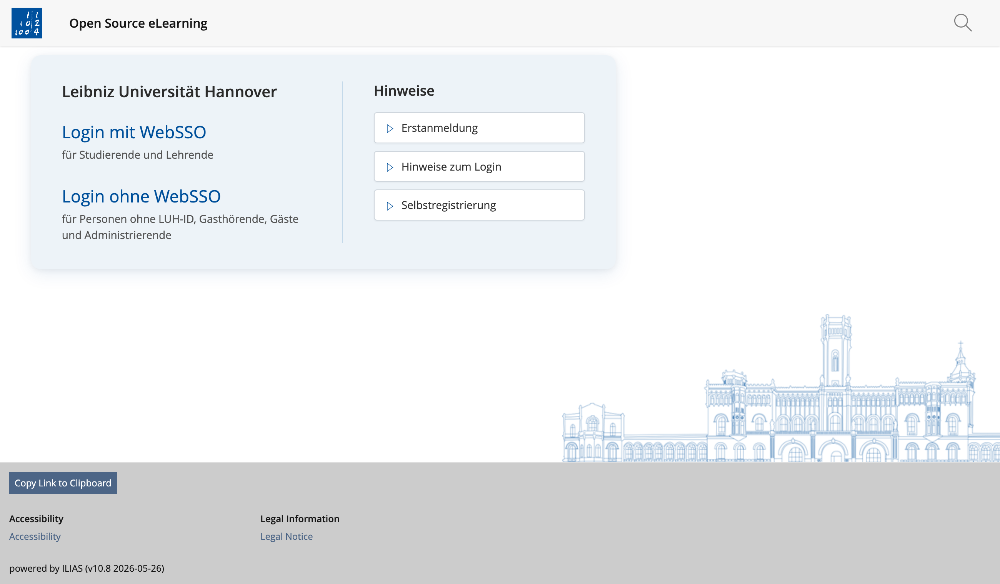

# LUH-Skin

Dieser Skin wurde dem [LUH-Stil](https://www.uni-hannover.de/) entsprechend angepasst.

---

## Version
v2.1.3 — für **ILIAS 10**

> Der ILIAS-9-Stand bleibt auf den `v1.x`-Tags erhalten (zuletzt `v1.3.0`).

* [CHANGELOG](CHANGELOG.md)

---

## 📸 Screenshot


*LUH-Login auf ILIAS 10.8*

---

## 📁 Installation

### Schritt 1: Zur ILIAS-Root-Installation wechseln

> **ILIAS 10:** Der Skin liegt jetzt unter `public/Customizing/skin/` – das
> Segment `global` aus ILIAS 9 entfällt.

```bash
cd /srv/ilias-luh/ILIAS/
cd public/Customizing/
```

### Schritt 2: Ordner "skin" anlegen (falls nicht vorhanden)

```bash
mkdir skin
cd skin
```

### Schritt 3: LUH-Skin klonen

```bash
git clone https://github.com/iFadi/LUH-Skin.git
cd LUH-Skin
```

### Schritt 4: Branch oder Tag auswählen

Beispiel für einen stabilen Release-Tag:

```bash
git checkout tags/v2.1.3
```

Falls du dich auf dem `main`-Branch befindest, kannst du einfach ein Pull durchführen:

```bash
git pull
```

✅ Das war's – der Skin ist installiert.

> **Hinweis (Registrierungs-Patch):** Der Skin enthält unter
> `components/ILIAS/Registration/` eine angepasste ILIAS-Kernklasse
> (`class.ilAccountRegistrationGUI.php`), die zusätzlich Benutzernamen im
> Format `XXX-XXX` ablehnt. Diese Datei ist **kein** Skin-Override, sondern ein
> Kern-Patch und muss manuell kopiert sowie bei jedem ILIAS-Update neu aus der
> Kernklasse abgeleitet werden – siehe
> [components/ILIAS/Registration/README.md](components/ILIAS/Registration/README.md).

---

## 🔧 Für die Implementierung

Zur Anpassung des Skins müssen die `.scss`-Dateien bearbeitet werden. Anschließend ist das Skript `update-skin.sh` auszuführen, um die **SCSS-Dateien zu kompilieren**.

**Wichtig:** Das Skript importiert die ILIAS-Basis (`delos`) über einen relativen Pfad
(`@use ".../templates/default/delos"`). SCSS-`@use`-Pfade sind statisch – der `dev`-/Base-Path-Parameter
ändert nur die **Font-/Bild-URLs**, nicht diesen Import. Daher gibt es zwei Wege:

**A) Innerhalb einer ILIAS-Installation (Standard, z. B. Produktiv-/Testsystem):**
Der Skin liegt unter `public/Customizing/skin/luh/`, der relative Pfad löst sich automatisch auf.

```bash
./update-skin.sh prod
```

**B) Standalone / lokal (Skin-Klon ohne ILIAS drumherum):**
Den Pfad zur ILIAS-Wurzel (Ordner mit `templates/default/`) per 3. Argument **oder** `ILIAS_ROOT` angeben:

```bash
# z. B. templates aus einem laufenden ILIAS-10-Container holen:
docker cp ilias10:/var/www/html/templates /pfad/zu/ilias10/templates

ILIAS_ROOT=/pfad/zu/ilias10 ./update-skin.sh prod
# oder:  ./update-skin.sh prod "" /pfad/zu/ilias10
```

### 📌 Hinweise:

* Das Skript verwendet die **Systemzeit**, um die generierten CSS-Dateien mit einer **eindeutigen ID** zu versehen.
* Diese ID wird an den Hauptdateinamen `LUH-Style.css` angehängt. → Dadurch wird ein **automatisches Neuladen im Browser** erzwungen (Cache-Busting).
* Sollte auf dem produktiven System `dart-sass` **nicht installiert** sein, kann das Skript **nicht ausgeführt** werden.

### 💡 Empfehlung:

Kompiliere die `LUH-Style.css` auf einem **Testsystem** (z. B. mit definierter Tag-/Skin-Version) und übertrage sie anschließend auf das **Produktivsystem**.

---

## ✅ Kompatibilität

Dieses Release ist für **ILIAS v10.x** vorgesehen.

* Für **ILIAS 9** den Tag `v1.3.0` verwenden.

---

## ⚠️ Wartungshinweis

Bei **jedem ILIAS-Update** (Minor- und Major-Versionen) muss:

* der **Skin neu kompiliert** werden
* die **Funktionalität des Skins getestet** werden, um sicherzustellen, dass er weiterhin korrekt dargestellt wird

---
